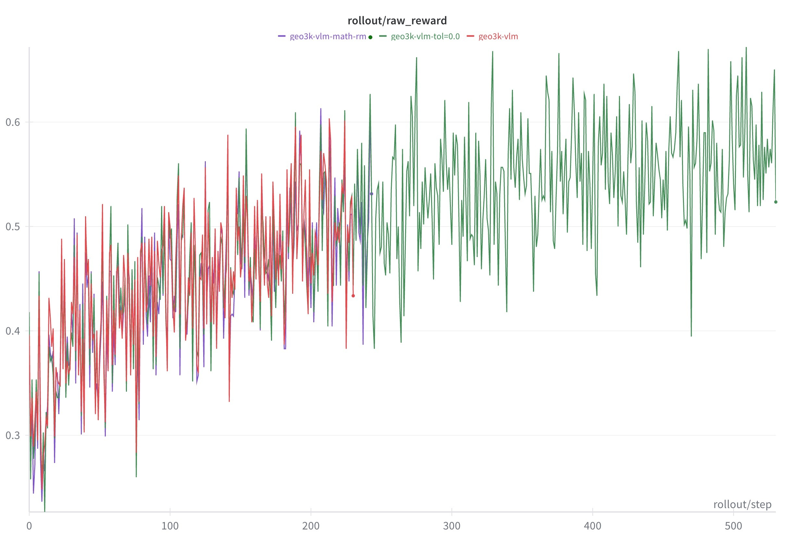

# FSDP + VLM Single-Turn RL

Training VLMs with FSDP on single-turn reasoning task using GRPO on the [GEO3K dataset](https://huggingface.co/datasets/hiyouga/geometry3k). We used processed version [here](https://huggingface.co/datasets/chenhegu/geo3k_imgurl).

<p align="center">
  
</p>

## Reproduce

```bash
export WANDB_API_KEY=your_wandb_api_key

SLIME_SCRIPT_MODEL_NAME=Qwen3-VL-2B-Instruct SLIME_SCRIPT_NUM_GPUS=8 python examples/geo3k_vlm/run_geo3k_vlm.py 2>&1 | tee run_simple.log
```

## Notes

### Reward Model Configuration

We experimented with three reward model configurations:
1. A geo3k-specific RM with tolerance=0.05 (to handle rounding in ground truth labels)
2. A geo3k-specific RM with tolerance=0.0 (strict matching)
3. The default math RM

All three performed similarly, so we use the default math RM for simplicity.

### Numerical Precision with Non-Binary Rewards

Our initial geo3k-specific verifier produced "format scores" (**0 and 0.9**) instead of clean binary rewards. Under **fp32**, fractional values like 0.9 can't be exactly represented, so when all samples in a group have the same reward, `reward - mean` doesn't equal zero—creating spurious gradient signal.

We fixed this by switching to the default math RM with clean **binary 0/1 rewards**. If you encounter similar precision issues with non-binary rewards, you can change the reward tensor dtype from `torch.float` to `torch.float16` in `slime/ray/rollout.py` (`_post_process_rewards` method) to truncate precision artifacts.