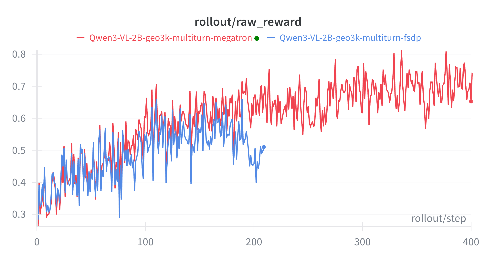
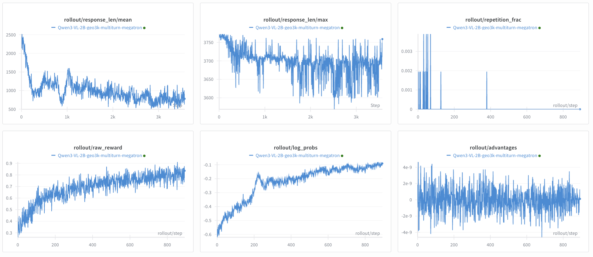

# VLM Multi-Turn (geo3k dataset)
Training VLM on [geo3k dataset](https://huggingface.co/datasets/hiyouga/geometry3k) with multi-turn reasoning with interactive environment feedback, using GRPO. For the dataset, we used the [processed version](https://huggingface.co/datasets/VeraIsHere/geo3k_imgurl_processed).

Note: Please make sure the cudnn version in the environment is 9.16.0.29 to prevent severe performance regression in conv3d in torch 2.9 mentioned in https://github.com/pytorch/pytorch/issues/168167. Otherwise, you can reinstall cudnn with:
```bash
pip install nvidia-cudnn-cu12==9.16.0.29
```

The multi-turn rollout is implemented through a [custom generate function](rollout.py#L309), overriding the original generate function.

In terms of the environment interaction, this example initializes a [custom interactive environment](env_geo3k.py) with the APIs below.
<details>
<summary>Environment API (geo3k)</summary>

- `build_env(sample: Sample | None = None, args: Any | None = None, **_) -> Geo3kEnv`: constructs the env.
- `reset() -> tuple[dict, dict]`: clears internal state.
- `step(response_text: str) -> tuple[dict, bool, dict]`: parses the actor's response text and update the state. Return new observation, a flag that marks whether the task is done, and step_info.
- `format_observation(observation: dict) -> dict`: converts an env observation into a chat message.
</details><br>


The reward model is the default math RM. 




## Reproduce
```bash
# 1) Set environment variable
export WANDB_API_KEY=...
export SLIME_SCRIPT_MODEL_NAME=Qwen3-VL-2B-Instruct
export SLIME_SCRIPT_NUM_GPUS=4
export SLIME_SCRIPT_TRAIN_BACKEND=fsdp

# 2) Download the dataset
hf download --repo-type dataset VeraIsHere/geo3k_imgurl_processed --local-dir /root/datasets/geo3k_imgurl_processed

# 3) Run the script:
cd /root/slime
python examples/geo3k_vlm_multi_turn/run_geo3k_vlm_multi_turn.py
```

## What each file does
- `examples/geo3k_vlm_multi_turn/run_geo3k_vlm_multi_turn.py`: downloads model, sets training/rollout args, and launches the run.
- `examples/geo3k_vlm_multi_turn/geo3k_vlm_multi_turn_config.yaml`: specifies `max_turns` and `rollout_interaction_env_path` for the multi-turn rollout.
- `examples/geo3k_vlm_multi_turn/rollout.py`: custom multi-turn rollout that calls SGLang for token generation, builds loss masks/log_probs, enforces max_turns, and early-stops on max_new_tokens.
- `examples/geo3k_vlm_multi_turn/env_geo3k.py`: geo3k tool-calling env that parses <tool_call>{...}</tool_call>, scores math answers, and returns tool feedback per turn.
