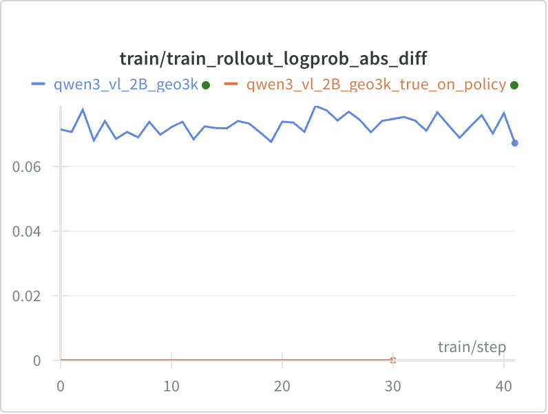

# True On-Policy between Training and Inference for VLM

This example demonstrates true on-policy training with Qwen3-VL dense model on FSDP. The core concepts and expected observations are the same as [true_on_policy](../true_on_policy/README.md).

<p align="center">
  
</p>

## Usage

```bash
SLIME_SCRIPT_NUM_GPUS=8 python examples/true_on_policy_vlm/run_simple.py
```

## How it is Implemented

For the text backbone, please refer to [true_on_policy for the text-only model](../true_on_policy/README.md).

For the VLM, we only need to ensure that the image encoder behaves as expected. Please refer to [SGLang#14636](https://github.com/sgl-project/sglang/pull/14636). We need to align numeric operation details between the two systems, so that the ViT forward pass matches the behavior in both SGLang and transformers.

## Notes

It is expected that the true-on-policy version is slower.